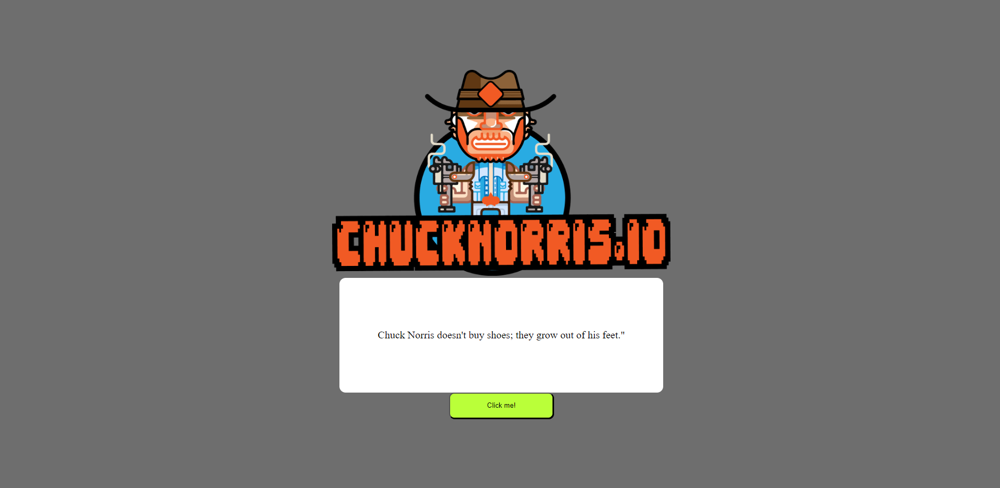

<!-- PROJECT LOGO -->

  <h1 align="center">Chuck Norris Joke Generator</h1>

  
 
 ### Click here for live demo   <a href="generatechucknorrisjoke.netlify.app">Chuck Norris Joke Generator</a>

<!-- ABOUT THE PROJECT -->

## About The Project:

### Homepage:

#### The common funtionalities are:

-The user can generate jokes by clicking a button

I'm using [Chuck Norris.io ](https://api.chucknorris.io) to get jokes.

##### Credit: Chuck Norris.io

### Built With

- #### Plain Javascript
- #### Materialize
- #### Chuck Norris.io

### Key concepts:

- #### Materialize CSS
- #### Fetching data from an API
- #### Handling events
- #### String manipulation
- #### Filtering data
- #### JavaScript Object Oriented Programming

<!-- GETTING STARTED -->

# Getting Started

This project was bootstrapped with [Create React App](https://github.com/facebook/create-react-app).

## Available Scripts

### To run project:

### `npm start`

### To build project:

### `npm run build`
